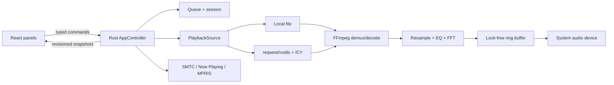

# Tonelag

An open-source, cross-platform audio player with a compact three-panel interface
and compatibility with Winamp 2.x `.wsz` skins. Its original default skin is
named **Model 275**, after the classic interface width of 275 pixels.

> Winamp is a trademark of its respective owner. This project is not affiliated
> with or endorsed by Winamp. No Winamp source code, logos, default artwork, or
> unlicensed skins are distributed here.

## Current implementation

- Tauri 2 desktop shell with React/TypeScript panels for the main player,
  10-band equalizer, and playlist.
- Rust-owned, revisioned state shared by every window; atomic settings and
  session persistence never auto-resumes playback.
- Native FFmpeg decode/resample → DSP/FFT → lock-free ring buffer → CPAL output.
- Local queues, recursive folders, drag-and-drop, shuffle/repeat, missing-file
  preservation, and M3U/M3U8/PLS import/export.
- MP3/AAC internet radio, redirects, remote M3U/PLS resolution, ICY metadata,
  adaptive buffering through AVIO, cancellable reads, and 1/2/4 second reconnect.
- Secure `.wsz` import with flat or one-level nested roots, case-insensitive
  assets, fallback artwork, cursors, playlist/visualization colors, and region
  clipping/hit-testing.
- Classic EQF import/export, winshade, 2× nearest-neighbor scaling, frameless
  panel snapping/group movement, and a combined Wayland layout.
- Windows SMTC, macOS Now Playing/Remote Command Center, and Linux MPRIS through
  a small isolated system-media adapter.
- English base strings and Norwegian translation; no telemetry or crash upload.

The first public release remains a **prerelease** until the six-target manual
matrix in [docs/RELEASE.md](docs/RELEASE.md) is completed. Code support is not a
claim that every target has already passed the 60-minute hardware test.

## Architecture



See [docs/ARCHITECTURE.md](docs/ARCHITECTURE.md) for boundaries and invariants.

## Development

Prerequisites: Node.js 24+, pnpm 11, Rust 1.97.1, Tauri's OS dependencies, and
shared FFmpeg 8 libraries discoverable through `pkg-config`.

```bash
pnpm install
pnpm bindings
pnpm build
cargo test --manifest-path src-tauri/Cargo.toml
pnpm tauri dev
```

On Apple Silicon with Homebrew:

```bash
export PATH="/opt/homebrew/opt/rustup/bin:$PATH"
export PKG_CONFIG_PATH="/opt/homebrew/lib/pkgconfig:/opt/homebrew/opt/ffmpeg/lib/pkgconfig"
```

The pinned LGPL-only release libraries can be produced with
[`scripts/ffmpeg/build.sh`](scripts/ffmpeg/build.sh). It disables FFmpeg's
network stack; HTTP is owned by Rust and supplied through custom AVIO.
The release compliance and dynamic-linking rules are documented in
[`docs/FFMPEG.md`](docs/FFMPEG.md).

## Skins

Import `.wsz` or `.zip` from the **S** button. Missing individual resources fall
back to the original project artwork. The generated fixture at
[`assets/default-skin/model-275.wsz`](assets/default-skin/model-275.wsz)
is MIT/Apache-2.0 and may be redistributed.

Local files `TEAGUEK_2.wsz` and `RET_02.wsz` can be tested without copying them
into the repository:

```bash
TONELAG_LOCAL_SKINS="/path/TEAGUEK_2.wsz:/path/RET_02.wsz" \
  cargo test --manifest-path src-tauri/Cargo.toml \
  validates_local_manual_samples -- --ignored
```

## Spotify

Spotify is deliberately absent from v1. A provider may only be added after the
policy/quota gate and a six-target Web Playback SDK/EME spike both pass. Its
audio must bypass FFmpeg, EQ, and analysis. See [docs/SPOTIFY.md](docs/SPOTIFY.md).

## License

Project code and original artwork are dual-licensed under MIT or Apache-2.0.
FFmpeg is dynamically linked in LGPL-only mode and released with matching source,
configuration, and notices. See [THIRD_PARTY_NOTICES.md](THIRD_PARTY_NOTICES.md).
